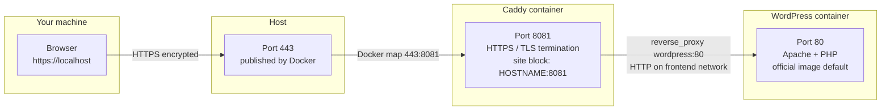

# wordpress_template
This project sets up a **WordPress** web-instance using Docker Compose with three main services, plus an optional **Kopia** backup service:

---

## 📦 Services Overview

### 1. **WordPress**
- **Image**: `wordpress:latest`
- **Port**: Exposed via Caddy
- **Volumes**: Persists WordPress content in the `wordpress` volume
- **Environment**:
  - Reads database credentials from `.env`
- **Networks**:
  - `frontend`: connects to Caddy
  - `backend`: connects to MySQL

### 2. **Caddy (Web Server & Reverse Proxy)**
- **Image**: `caddy:2.10`
- **Port Mapping**: host `443` → Caddy container port `8081` (browser URL uses port 443, e.g. `https://localhost` or `https://yourdomain.com`)
- **TLS**: Uses `tls internal` or Let's Encrypt depending on configuration
- **Config**: 
  - Loaded from a generated `Caddyfile` in the `conf/` directory
- **Features**:
  - Automatic HTTPS (for real domains) or internal TLS for development
  - Gzip compression
- **Volumes**:
  - Persists TLS and configuration data via `caddy_data` and `caddy_config`
- **Security**:
  - Runs as read-only
  - Uses `tmpfs` for temporary and cert-related directories
  - Requires `NET_ADMIN` capability (needed for Caddy’s network config)

### 3. **MySQL (Database)**
- **Image**: `mysql:5.7`
- **Volumes**: Data persisted in `db_data`
- **Environment**:
  - Fully controlled via `.env` (e.g., DB name, user, root password)
- **Networks**:
  - `backend`: communicates only with WordPress

### 4. **WP-CLI (WordPress administration)**
- **Image**: `wordpress:cli`
- **Profile**: `tools` — not started by `./run.sh`; runs on demand for install and admin tasks
- **Volumes**: Shares the `wordpress` volume with the WordPress container (`/var/www/html`)
- **Database**: Connects to MySQL over the `backend` network (does not mount `db_data`)
- **User**: Runs as `33:33` to match file ownership in the WordPress container

### 5. **Kopia (Backups)**
- **Image**: `kopia/kopia:latest`
- **Profile**: `backup` — not started by `./run.sh`; runs on demand via `backup.sh` or cron
- **Mode**: CLI-only (no web UI, no exposed port)
- **Repository**: Encrypted filesystem repo stored in the `kopia_data` volume (`/data/repo`)
- **Snapshots** (read-only mounts):
  - `wordpress` → `/backup/wordpress`
  - `db_data` → `/backup/db`
  - `caddy_data` → `/backup/caddy_data`
  - `caddy_config` → `/backup/caddy_config`
- **Persistence**: Config, cache, and logs in `kopia_config`, `kopia_cache`, and `kopia_logs`

---

## Port wiring

Traffic from your browser never hits WordPress directly. Caddy is the only service published to the host; it terminates HTTPS and forwards plain HTTP to WordPress on the internal Docker network.

The `:8081` in the Caddyfile (`localhost:8081`) is Caddy's **listen port inside the container**. It is not a port you type in the browser. With the default mapping `"443:8081"`, you open `https://localhost` (host port 443).



| Step | Where | Port | Protocol | Defined in |
| --- | --- | --- | --- | --- |
| 1 | Browser | 443 | HTTPS | Standard HTTPS URL (`https://localhost`) |
| 2 | Host → Caddy | 443 → 8081 | HTTPS | [docker-compose.yml](docker-compose.yml) `ports: "443:8081"` |
| 3 | Caddy listens | 8081 | HTTPS | [conf/Caddyfile.template](conf/Caddyfile.template) `${HOSTNAME}:8081` |
| 4 | Caddy → WordPress | 80 | HTTP | Caddyfile `reverse_proxy wordpress:80` |
| 5 | WordPress serves | 80 | HTTP | `wordpress:latest` image (Apache default) |

WordPress has no host port mapping — it is only reachable as `wordpress:80` from other containers on the `frontend` network (primarily Caddy).

To verify WordPress listens on 80:

```bash
docker inspect wordpress:latest --format '{{json .Config.ExposedPorts}}'
docker compose exec caddy wget -qO- http://wordpress:80 | head -5
```

---

## ⚙️ Configuration

### `.env` File

Before running the stack, create a `.env` file in the root directory with:

```env
HOSTNAME=wp.local
EMAIL=hostmaster@fenker.eu

DB_NAME=wordpress
DB_USER=wordpress
DB_PASSWORD=your_db_password
DB_ROOT_PASSWORD=your_root_password

# Encryption password for the Kopia backup repository
KOPIA_PASSWORD=your_kopia_password
```

### Run the Stack

To start the services, run:

```bash
./run.sh
```

The caddyfile needs to be rendered with the .env variables, which is done in the `run.sh` script.

---

## 💾 Backups with Kopia

Backups use Kopia in **CLI-only** mode: there is no long-running Kopia container and no web interface. The `backup.sh` script spins up a temporary Kopia container, creates snapshots, runs maintenance, and exits.

On the **first run**, `backup.sh` also creates the repository and sets default policies (zstd compression; retention: 7 latest, 14 daily, 8 weekly, 12 monthly). Later runs only snapshot and maintain.

### Run a backup manually

From the project root:

```bash
./backup.sh
```

### Schedule daily backups (cron)

Add a crontab entry on the host (adjust time and path as needed):

```cron
0 2 * * * /path/to/wordpress_template/backup.sh >> /var/log/kopia-backup.log 2>&1
```

Edit with `crontab -e`.

### Kopia CLI via Docker Compose

All commands below use the `backup` profile and run Kopia in a one-off container. Run them from the project root.

**Repository status** (connected repo, storage usage):

```bash
docker compose --profile backup run --rm -T kopia repository status
```

**List snapshots**:

```bash
docker compose --profile backup run --rm -T kopia snapshot list
```

**Show a specific snapshot** (paths, sizes, IDs):

```bash
docker compose --profile backup run --rm -T kopia snapshot list --all
```

**View retention/compression policy** (global or per path):

```bash
docker compose --profile backup run --rm -T kopia policy get --global
docker compose --profile backup run --rm -T kopia policy get /backup/wordpress
```

**Restore a snapshot** (replace `<snapshot-id>` with an ID from `snapshot list`):

```bash
mkdir -p ./restore
docker compose --profile backup run --rm -T \
  -v "$(pwd)/restore:/restore" \
  kopia snapshot restore <snapshot-id> /restore
```

**Run maintenance manually** (garbage collection, compaction):

```bash
docker compose --profile backup run --rm -T kopia maintenance run --full
```

**View recent Kopia CLI logs** (stored in the `kopia_logs` volume):

```bash
docker compose --profile backup run --rm --entrypoint sh kopia \
  -c 'ls -lt /app/logs/cli-logs | head; tail -20 /app/logs/cli-logs/*.log'
```

### MySQL backup note

The database is backed up as a raw copy of the MySQL data directory. If MySQL is running during the snapshot, the backup may be inconsistent. For production, consider stopping the database briefly during backup or adding a `mysqldump` step before the Kopia snapshot.

---

## Production bootstrap with WP-CLI

On first deploy, WordPress shows a setup wizard at `/wp-admin/install.php`. Anyone who can reach the site before you do can create the admin account. To avoid that race, install WordPress privately before opening port 443 to the public:

1. Start the stack with port 443 blocked (firewall), bound to `127.0.0.1` only, or before DNS points at the server.
2. Run `wp core install` via the `wpcli` service (creates admin account and closes the install wizard).
3. Verify login, then open the site to the public.

The `wpcli` service mounts the same `wordpress` volume and uses the same database credentials as the WordPress container. The `--rm` flag only removes the ephemeral container; data is stored in the named volumes.

### Local testing (verified example)

With `HOSTNAME=localhost` in `.env`, Docker maps host port **443** to Caddy's internal port **8081**. The Caddy site block is named `localhost:8081`, but that `:8081` is **inside the container** — your browser URL does **not** include it.

| Use in browser / `--url` | Works? |
|---|---|
| `https://localhost` | Yes |
| `https://localhost:8081` | No (port 8081 is not published on the host) |
| `https://172.x.x.x` (container IP from logs) | No (WordPress is not exposed directly; only Caddy is) |

Start the stack, wait until WordPress has copied its files into the volume, then install:

```bash
./run.sh

docker compose --profile tools run --rm wpcli core install \
  --url="https://localhost" \
  --title="Local WordPress" \
  --admin_user=admin \
  --admin_password='local-dev-password' \
  --admin_email=admin@example.com \
  --skip-email
```

Open `https://localhost/wp-login.php` and log in with the credentials above. Accept the self-signed certificate warning if your browser shows one (Caddy `tls internal` for localhost).

The Apache `ServerName` / container IP messages in the WordPress logs are normal and unrelated to the site URL WordPress stores.

### Production install

Use the same URL you will type in the browser. With the default port mapping `443:8081`, that is `https://yourdomain.com` (no `:8081` suffix):

```bash
docker compose --profile tools run --rm wpcli core install \
  --url="https://yourdomain.com" \
  --title="My Site" \
  --admin_user=admin \
  --admin_password='strong-password' \
  --admin_email=you@example.com \
  --skip-email
```

**Check whether WordPress is already installed**:

```bash
docker compose --profile tools run --rm wpcli core is-installed && echo "installed" || echo "not installed"
```

**Other useful WP-CLI commands**:

```bash
docker compose --profile tools run --rm wpcli user list
docker compose --profile tools run --rm wpcli plugin list
docker compose --profile tools run --rm wpcli option get siteurl
```

If you installed under a temporary hostname (e.g. `localhost`) and later change `HOSTNAME` in `.env`, update stored URLs before going public:

```bash
docker compose --profile tools run --rm wpcli search-replace \
  'https://localhost' 'https://yourdomain.com' --all-tables
```

---

## A Quick Guide on WordPress

User Login URL: `https://<hostname>/wp-login.php`
